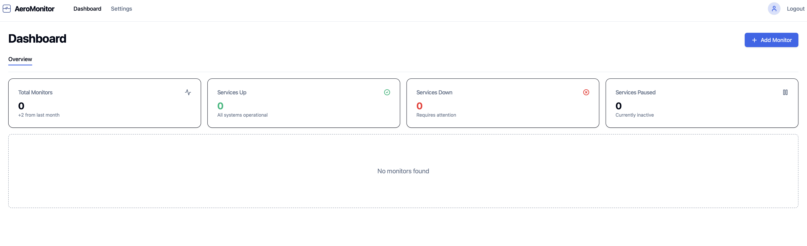
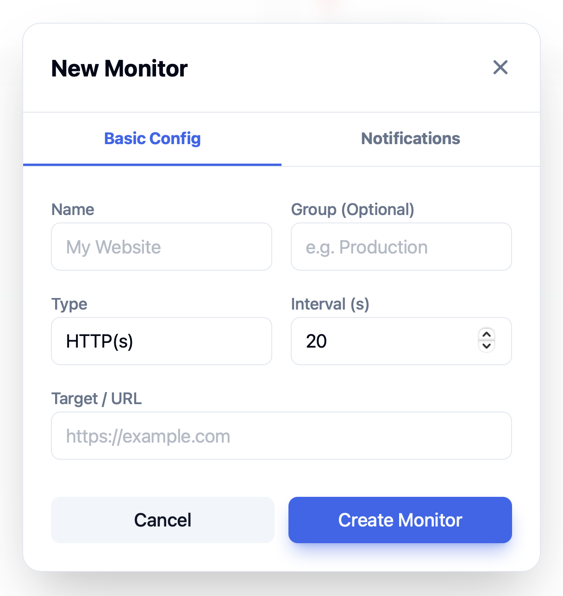
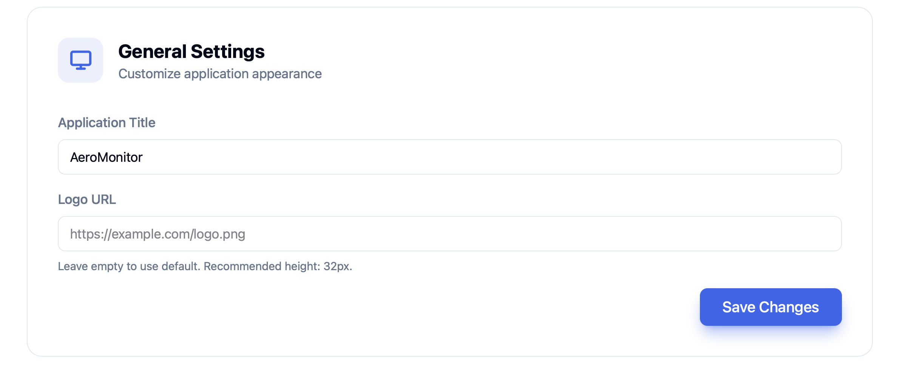
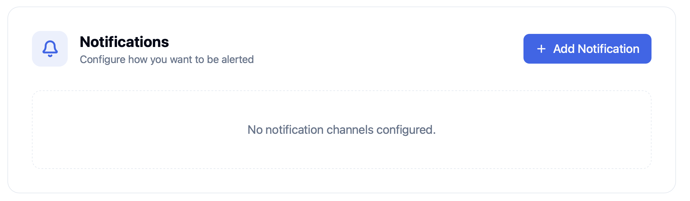
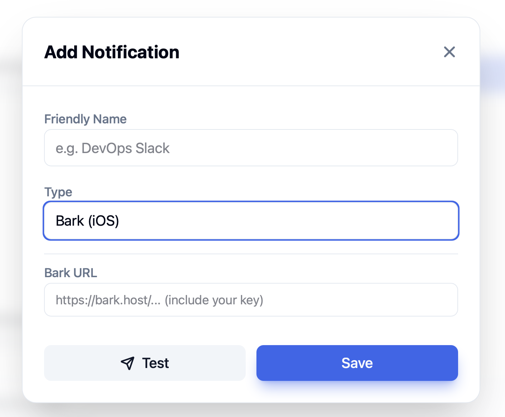
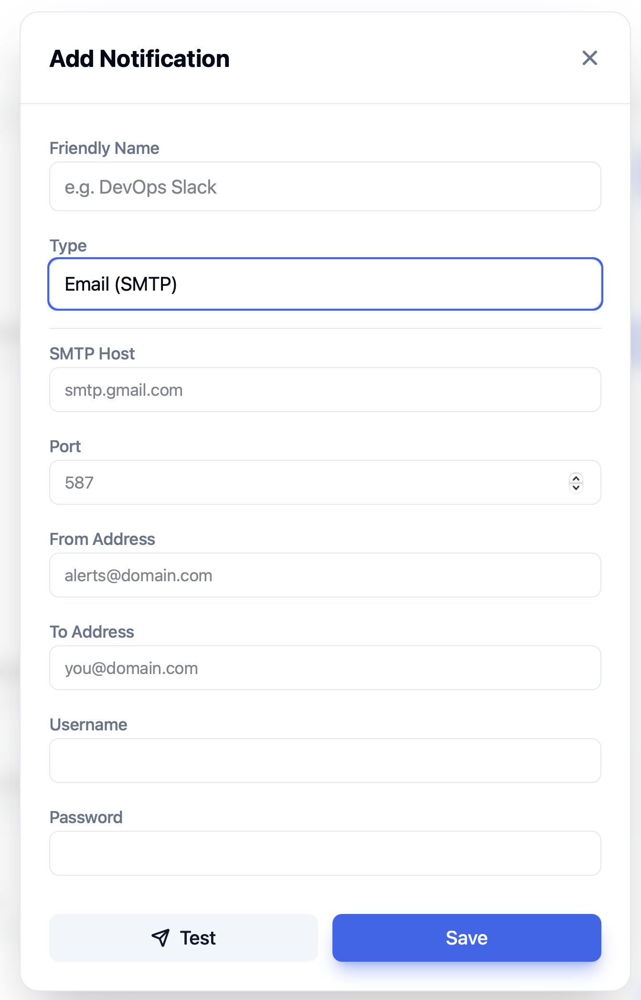
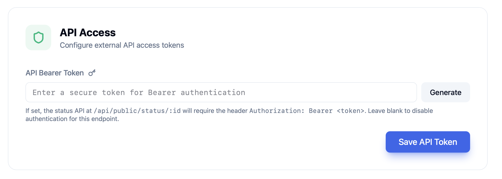
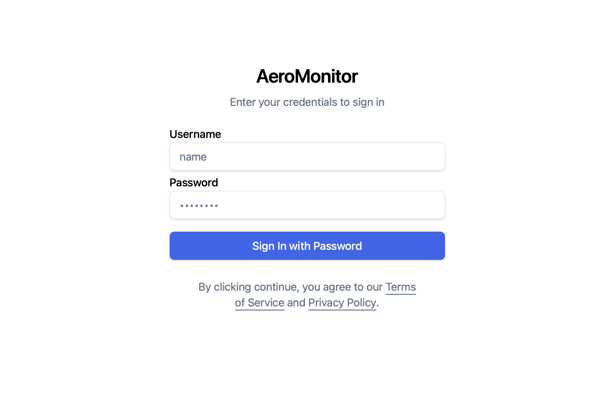
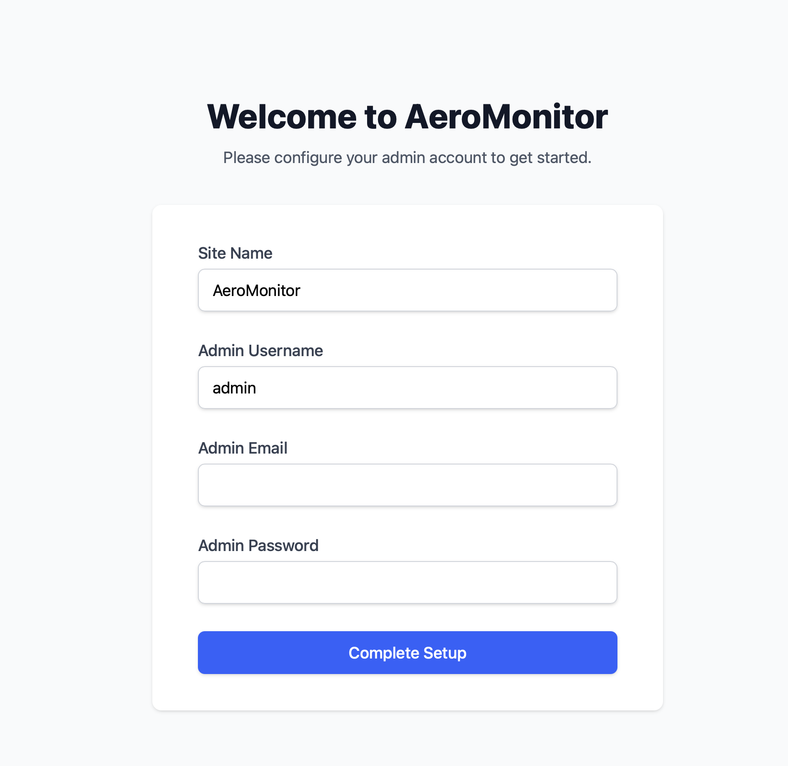

# AeroMonitor

A lightweight, self-hosted monitoring tool built with Go and React.

## Getting Started

### Prerequisites
- [Go](https://golang.org/dl/) (1.24)
- [Node.js](https://nodejs.org/) (for frontend development)
- [Docker](https://www.docker.com/) (optional, for containerized deployment)

### Running with Docker (Recommended)

**Quick Start with docker-compose:**

1. **Create environment file**:
   ```bash
   cp .env.example .env
   # Edit .env and set your JWT_SECRET and credentials
   ```

2. **Start the application**:
   ```bash
   docker-compose up -d
   ```

3. **Access the Dashboard**:
   Open [http://localhost:8080](http://localhost:8080) in your browser.

**Using Docker directly:**

```bash
# Build the image
docker build -t aeromonitor:latest .

# Run the container
docker run -d \
  -p 8080:8080 \
  -v aeromonitor-data:/app/data \
  -e JWT_SECRET=your-secret-key \
  --name aeromonitor \
  hdgnss/aeromonitor:latest
```

### Running Locally (Development)

1. **Build the Frontend**:
   (Already built in `ui/dist`)
   ```bash
   cd ui
   npm install
   npm run build
   cd ..
   ```

2. **Run the Server**:
   ```bash
   go run cmd/server/main.go
   ```

3. **Access the Dashboard**:
   Open [http://localhost:8080](http://localhost:8080) in your browser.

## Configuration

### Environment Variables

- `HTTP_PORT` - Server HTTP port (default: 8080)
- `JWT_SECRET` - Secret key for JWT token signing (required)
- `DB_PATH` - Database file path (default: ./aeromonitor.db)
- `OIDC_ENABLED` - Enable OIDC authentication (default: false)
- `OIDC_PROVIDER_URL` - OIDC provider URL
- `OIDC_CLIENT_ID` - OIDC client ID
- `OIDC_CLIENT_SECRET` - OIDC client secret
- `OIDC_REDIRECT_URL` - OIDC redirect URL

See `.env.example` for a complete configuration template.

## Features
- **HTTP/TCP/Ping Monitoring**: Track service availability and latency.
- **File Update Monitoring**: Monitor file changes and freshness.
- **Flexible Push API**: Send custom data points and visualize them instantly.
- **Monitor Pause/Resume**: Temporarily disable monitoring for maintenance.
- **Premium UI**: Dark-themed, responsive, and reactive dashboard.
- **Notifications**: Bark and Microsoft Teams support.
- **Authentication**: JWT-based auth with optional OIDC integration.
- **Public Status Pages**: Share monitor status publicly.
- **Lightweight**: Minimal resource footprint.

## Supported APIs

### Push API
Send data to your push monitors using simple GET or POST requests:
```bash
GET http://localhost:8080/api/push/{monitor_id}?status=up&msg=OK&cpu=25&mem=60
```

### Public Status API
Get the current status and latest data for a monitor:
```bash
GET http://localhost:8080/api/public/status/{monitor_id}
```
*Requires `Authorization: Bearer <token>` header if `api_bearer_token` is configured.*

### Data Export API
Export monitor history as CSV:
```bash
GET http://localhost:8080/api/monitors/{monitor_id}/export?start=2025-12-19T04:15:00Z&end=2025-12-26T04:15:00Z
```
*   **Auth**: Requires `Authorization: Bearer <token>` header or `?token=<token>` query parameter if `api_bearer_token` is configured.
*   **Params**: `start` and `end` (ISO 8601 or RFC3339 format). Defaults to last 30 days if omitted.

## Screenshots

### Dashboard


### Monitor Management
| Basic Info | Notifications |
| :---: | :---: |
|  |  |

### Settings & Notifications
| General Settings | Notification Channels |
| :---: | :---: |
|  |  |

| Bark Notification | Email Notification |
| :---: | :---: |
|  |  |

### Security & API
| Authentication | API Access |
| :---: | :---: |
|  |  |

### Login & Setup
| Login | Initial Setup |
| :---: | :---: |
|  |  |
